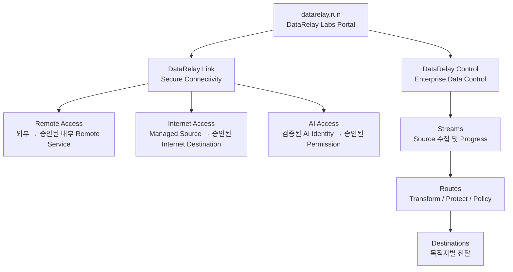

# 프로젝트 관계 및 디렉터리

## 프로젝트 관계 한눈에 보기

이 구조는 **하나의 통합 Runtime이 아니라 독립 제품들의 Family**입니다. `datarelay.run`은 제품을 찾기 위한 Portal이며 두 제품 간 Runtime 의존성을 의미하지 않습니다.

## 현재 프로젝트 디렉터리

| 제품 | 주요 목적 | 제품 페이지 |
| --- | --- | --- |
| **DataRelay Link** | 폐쇄망/제한망을 위한 Remote Access, Internet Access, AI Access 기반 Secure Connectivity | [link.datarelay.run](https://link.datarelay.run/) |
| **DataRelay Control** | Enterprise Data 수집, Route Processing, Governance, Protection, Multi-Destination Delivery | [control.datarelay.run](https://control.datarelay.run/) |

## 제품 경계

<AccordionGroup>
  <Accordion title="DataRelay Link는 DataRelay Control이 아닙니다">
    Link는 무엇이 연결될 수 있는지를 제어합니다. Control의 Stream/Route/Destination Data Processing 모델을 제공하는 제품이 아닙니다.
  </Accordion>

  <Accordion title="DataRelay Control은 Link의 중앙 관리 제품이 아닙니다">
    Control은 Enterprise Data Flow를 관리합니다. 현재 Link의 Registration, Heartbeat, Policy Delivery, State Synchronization을 담당하는 중앙 Controller가 아닙니다.
  </Accordion>

  <Accordion title="새 제품도 독립적으로 추가합니다">
    앞으로 DataRelay Labs에 새 제품이 생겨도 각 제품은 자신의 Runtime, Repository, Release Lifecycle, 전용 문서를 유지하면서 이 포털에서 함께 소개할 수 있습니다.
  </Accordion>
</AccordionGroup>

## 빠른 이동

<CardGroup cols={2}>
  <Card title="프로젝트 소개" icon="grid-2" href="/ko/projects">
    현재 제품을 비교하고 전용 문서로 이동합니다.
  </Card>
  <Card title="문제별 제품 찾기" icon="compass" href="/ko/choose-project">
    해결하려는 문제를 기준으로 적합한 제품을 선택합니다.
  </Card>
</CardGroup>
