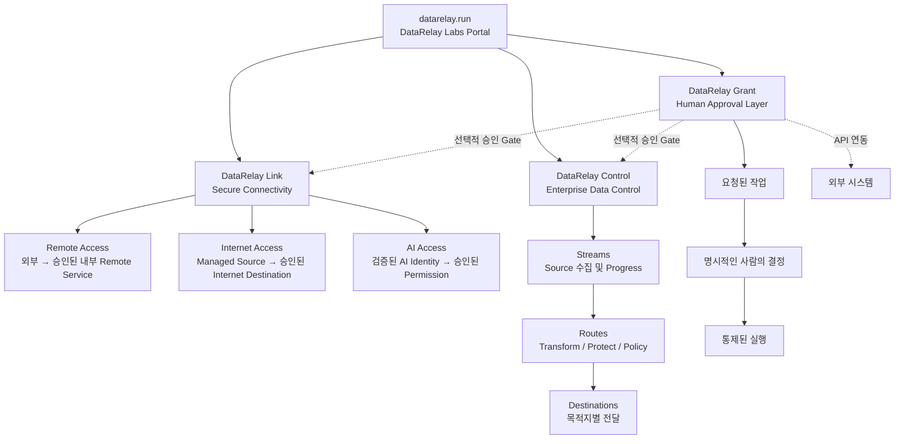

# 프로젝트 관계 및 디렉터리

## 프로젝트 관계 한눈에 보기

이 구조는 **하나의 통합 Runtime이 아니라 독립 제품들의 Family**입니다. `datarelay.run`은 제품을 찾기 위한 Portal이며 제품 간 필수 Runtime 의존성을 의미하지 않습니다.

DataRelay Grant는 Link와 Control과 다른 역할을 가집니다. Grant는 **선택적으로 사용할 수 있는 공통 승인 계층**을 목표로 하며, Link·Control 또는 외부 시스템의 작업이 실행되기 전에 사람의 결정을 요구할 때 호출될 수 있습니다. 실제 실행 책임과 Runtime은 각 제품 또는 외부 시스템에 그대로 남습니다.

## 현재 프로젝트 디렉터리

| 제품 | 주요 목적 | 제품 페이지 / Repository |
| --- | --- | --- |
| **DataRelay Link** | 폐쇄망/제한망을 위한 Remote Access, Internet Access, AI Access 기반 Secure Connectivity | [link.datarelay.run](https://link.datarelay.run/) |
| **DataRelay Control** | Enterprise Data 수집, Route Processing, Governance, Protection, Multi-Destination Delivery | [control.datarelay.run](https://control.datarelay.run/) |
| **DataRelay Grant** | US 12,056,667 B1 및 KR 10-2567118 B1 기반의 Coming Soon Human Approval / Execution Control Layer | [datarelay-grant-docs](https://github.com/datarelay-labs/datarelay-grant-docs) |

## 제품 경계

<AccordionGroup>
  <Accordion title="DataRelay Link는 DataRelay Control이 아닙니다">
    Link는 무엇이 연결될 수 있는지를 제어합니다. Control의 Stream/Route/Destination Data Processing 모델을 제공하는 제품이 아닙니다.
  </Accordion>

  <Accordion title="DataRelay Control은 Link의 중앙 관리 제품이 아닙니다">
    Control은 Enterprise Data Flow를 관리합니다. 현재 Link의 Registration, Heartbeat, Policy Delivery, State Synchronization을 담당하는 중앙 Controller가 아닙니다.
  </Accordion>

  <Accordion title="DataRelay Grant는 실행 Runtime이 아니라 승인 계층입니다">
    Grant는 사람의 명시적 승인 후 요청된 작업이 진행 가능한지를 결정하는 역할을 목표로 합니다. 실제 승인된 작업의 실행은 Link, Control 또는 해당 외부 시스템이 담당합니다.
  </Accordion>

  <Accordion title="Grant 연동은 선택 사항입니다">
    Link와 Control은 각각 독립적으로 사용할 수 있습니다. 사람의 승인 Gate가 필요한 경우 Grant가 보완할 수 있지만, 어느 제품도 Grant를 필수 Runtime으로 요구하지 않습니다.
  </Accordion>

  <Accordion title="새 제품도 독립적으로 추가합니다">
    앞으로 DataRelay Labs에 새 제품이 생겨도 각 제품은 자신의 Runtime, Repository, Release Lifecycle, 전용 문서를 유지하면서 이 포털에서 함께 소개할 수 있습니다.
  </Accordion>
</AccordionGroup>

## 빠른 이동

<CardGroup cols={2}>
  <Card title="프로젝트 소개" icon="grid-2" href="/ko/projects">
    현재 제품을 비교하고 전용 문서로 이동합니다.
  </Card>
  <Card title="문제별 제품 찾기" icon="compass" href="/ko/choose-project">
    해결하려는 문제를 기준으로 적합한 제품을 선택합니다.
  </Card>
</CardGroup>
