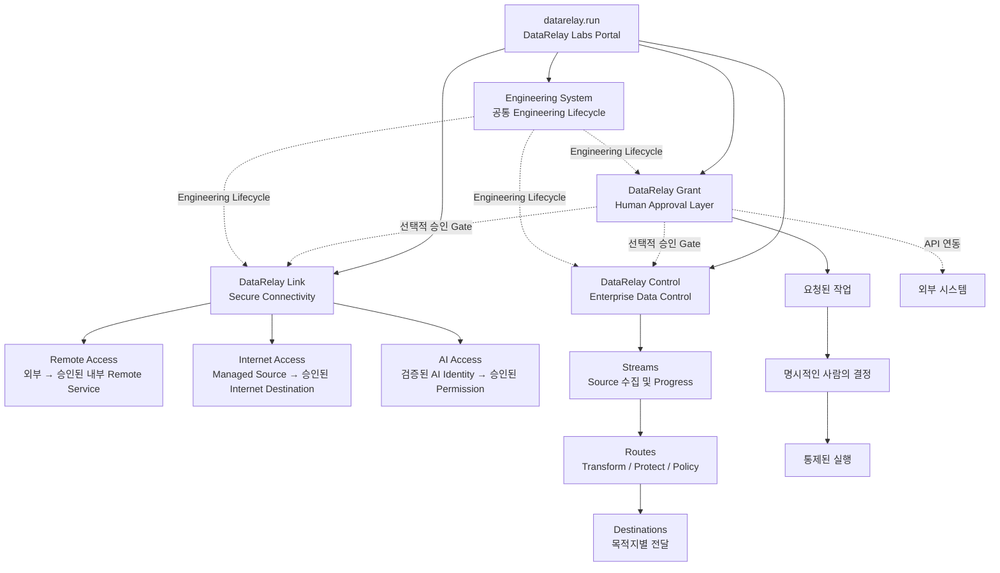

# 프로젝트 관계 및 디렉터리

## 프로젝트 관계 한눈에 보기

```mermaid
flowchart TD
    P[datarelay.run\nDataRelay Labs Portal]

    L[DataRelay Link\nSecure Connectivity]
    C[DataRelay Control\nEnterprise Data Control]
    G[DataRelay Grant\nHuman Approval Layer]
    E[Engineering System\n공통 Engineering Lifecycle]

    RA[Remote Access\n외부 → 승인된 내부 Remote Service]
    IA[Internet Access\nManaged Source → 승인된 Internet Destination]
    AI[AI Access\n검증된 AI Identity → 승인된 Permission]

    ST[Streams\nSource 수집 및 Progress]
    RT[Routes\nTransform / Protect / Policy]
    DS[Destinations\n목적지별 전달]

    REQ[요청된 작업]
    DEC[명시적인 사람의 결정]
    EXE[통제된 실행]

    P --> L
    P --> C
    P --> G
    P --> E

    L --> RA
    L --> IA
    L --> AI
    C --> ST --> RT --> DS
    G --> REQ --> DEC --> EXE

    G -. 선택적 승인 Gate .-> L
    G -. 선택적 승인 Gate .-> C
    G -. API 연동 .-> EXT[외부 시스템]

    E -. Engineering Lifecycle .-> L
    E -. Engineering Lifecycle .-> C
    E -. Engineering Lifecycle .-> G
```

이 구조는 **하나로 묶인 플랫폼이 아니라 독립 제품들의 모음**입니다. `datarelay.run`은 필요한 제품을 찾기 위한 포털이며, 한 제품을 사용하기 위해 다른 제품을 설치할 필요는 없습니다.

DataRelay Grant는 Link와 Control과 역할이 다릅니다. Grant는 **선택적으로 사용할 수 있는 공통 승인 단계**를 제공하며, Link·Control 또는 외부 시스템의 작업이 실행되기 전에 사람의 결정이 필요할 때 사용할 수 있습니다. 승인된 작업의 실제 실행은 요청한 제품이나 외부 시스템이 담당합니다.

## 현재 프로젝트 디렉터리

| 제품 | 주요 목적 | 제품 페이지 / Repository |
| --- | --- | --- |
| **DataRelay Link** | 폐쇄망/제한망을 위한 Remote Access, Internet Access, AI Access 기반 Secure Connectivity | [link.datarelay.run](https://link.datarelay.run/) |
| **DataRelay Control** | Enterprise Data 수집, Route Processing, Governance, Protection, Multi-Destination Delivery | [control.datarelay.run](https://control.datarelay.run/) |
| **DataRelay Grant** | US 12,056,667 B1 및 KR 10-2567118 B1 기반의 Coming Soon Human Approval / Execution Control Layer | [grant.datarelay.run](https://grant.datarelay.run/) |

## 공통 엔지니어링 기반

<Card title="Data Relay Engineering System" icon="code-branch" href="https://engineering.datarelay.run/ko">
  각 제품은 독립적으로 실행되지만 Engineering System을 통해 설계, 구현 전달, 테스트, PR/CI 검증, 릴리스, 운영, 작업 이어가기 절차를 공유합니다. 사람이 읽는 설명서는 engineering.datarelay.run에서 제공하고 실제 규칙은 [datarelay-labs/engineering-system](https://github.com/datarelay-labs/engineering-system)에 있습니다.
</Card>

Engineering System은 **별도의 제품이 아니며**, Link, Control, Grant 사이에 실행 의존성을 만들지 않습니다.

## 제품 경계

<AccordionGroup>
  <Accordion title="DataRelay Link는 DataRelay Control이 아닙니다">
    Link는 무엇이 연결될 수 있는지를 제어합니다. Control의 Stream/Route/Destination 데이터 처리 기능을 제공하는 제품은 아닙니다.
  </Accordion>

  <Accordion title="DataRelay Control은 Link의 중앙 관리 제품이 아닙니다">
    Control은 기업 데이터 흐름을 관리합니다. 현재 Link의 등록, Heartbeat, 정책 전달, 상태 동기화를 담당하는 중앙 관리 제품은 아닙니다.
  </Accordion>

  <Accordion title="DataRelay Grant는 실행 Runtime이 아니라 승인 계층입니다">
    Grant는 사람의 명시적인 승인 후 요청된 작업을 진행해도 되는지 결정하는 역할을 합니다. 승인된 작업의 실제 실행은 Link, Control 또는 해당 외부 시스템이 담당합니다.
  </Accordion>

  <Accordion title="Grant 연동은 선택 사항입니다">
    Link와 Control은 각각 독립적으로 사용할 수 있습니다. 사람의 승인 Gate가 필요한 경우 Grant가 보완할 수 있지만, 어느 제품도 Grant를 필수 Runtime으로 요구하지 않습니다.
  </Accordion>

  <Accordion title="새 제품도 독립적으로 추가합니다">
    앞으로 DataRelay Labs에 새 제품이 생겨도 각 제품은 자신의 Runtime, Repository, Release Lifecycle, 전용 문서를 유지하면서 이 포털에서 함께 소개할 수 있습니다.
  </Accordion>
</AccordionGroup>

## 빠른 이동

<CardGroup cols={2}>
  <Card title="프로젝트 소개" icon="grid-2" href="/ko/projects">
    현재 제품을 비교하고 전용 문서로 이동합니다.
  </Card>
  <Card title="문제별 제품 찾기" icon="compass" href="/ko/choose-project">
    해결하려는 문제를 기준으로 적합한 제품을 선택합니다.
  </Card>
</CardGroup>
