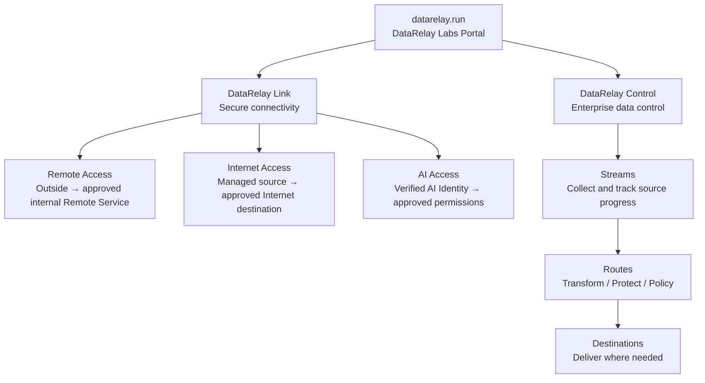

# Project Relationships & Directory

## How the projects fit together

This is a **product family, not one bundled runtime**. The portal helps users discover products; it does not imply a runtime dependency between them.

## Current project directory

| Product | Primary purpose | Product site |
| --- | --- | --- |
| **DataRelay Link** | Secure connectivity for isolated/restricted networks through Remote Access, Internet Access, and AI Access | [link.datarelay.run](https://link.datarelay.run/) |
| **DataRelay Control** | Enterprise data collection, route processing, governance, protection, and multi-destination delivery | [control.datarelay.run](https://control.datarelay.run/) |

## Product boundaries

<AccordionGroup>
  <Accordion title="DataRelay Link is not DataRelay Control">
    Link controls what can connect. It does not provide the Stream/Route/Destination data-processing model used by Control.
  </Accordion>

  <Accordion title="DataRelay Control is not a manager for Link">
    Control manages enterprise data flows. It is not currently a centralized registration, heartbeat, policy-delivery, or state-synchronization controller for Link.
  </Accordion>

  <Accordion title="Future products remain independent">
    New DataRelay Labs products can use their own runtime, repository, release lifecycle, and documentation site while still being discoverable from this portal.
  </Accordion>
</AccordionGroup>

## Quick navigation

<CardGroup cols={2}>
  <Card title="Projects" icon="grid-2" href="/projects">
    Compare the current products and open their dedicated documentation.
  </Card>
  <Card title="Choose by problem" icon="compass" href="/choose-project">
    Select a product based on the problem you need to solve.
  </Card>
</CardGroup>
