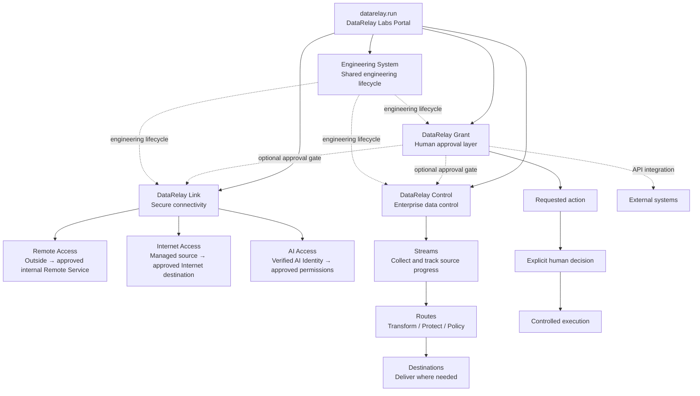

# Project Relationships & Directory

## How the projects fit together

This is a **product family, not one bundled runtime**. The portal helps users discover products; it does not imply a mandatory runtime dependency between them.

DataRelay Grant is different from Link and Control in one important way: it is planned as an **optional shared approval layer**. A Link, Control, or external-system action may call Grant when a human decision is required before execution, while each product still keeps its own runtime and responsibility.

## Current project directory

| Product | Primary purpose | Product site / repository |
| --- | --- | --- |
| **DataRelay Link** | Secure connectivity for isolated/restricted networks through Remote Access, Internet Access, and AI Access | [link.datarelay.run](https://link.datarelay.run/) |
| **DataRelay Control** | Enterprise data collection, route processing, governance, protection, and multi-destination delivery | [control.datarelay.run](https://control.datarelay.run/) |
| **DataRelay Grant** | Coming-soon human approval and execution-control layer based on US 12,056,667 B1 and KR 10-2567118 B1 | [grant.datarelay.run](https://grant.datarelay.run/) |

## Shared engineering foundation

<Card title="Data Relay Engineering System" icon="code-branch" href="https://engineering.datarelay.run/">
  The products remain runtime-independent, while the Engineering System provides the shared lifecycle for design, implementation handoff, deterministic testing, PR/CI verification, release evidence, operations, and session continuity. The handbook is human-readable; the canonical standard lives in [datarelay-labs/engineering-system](https://github.com/datarelay-labs/engineering-system).
</Card>

The Engineering System is **not another product runtime** and does not create a runtime dependency between Link, Control, and Grant.

## Product boundaries

<AccordionGroup>
  <Accordion title="DataRelay Link is not DataRelay Control">
    Link controls what can connect. It does not provide the Stream/Route/Destination data-processing model used by Control.
  </Accordion>

  <Accordion title="DataRelay Control is not a manager for Link">
    Control manages enterprise data flows. It is not currently a centralized registration, heartbeat, policy-delivery, or state-synchronization controller for Link.
  </Accordion>

  <Accordion title="DataRelay Grant is an approval layer, not the execution runtime">
    Grant is intended to decide whether a requested action may proceed after explicit human approval. The actual approved action remains the responsibility of Link, Control, or the external system that performs it.
  </Accordion>

  <Accordion title="Grant integration is optional">
    Link and Control remain independently usable products. Grant may complement them when a human approval gate is required, but neither product depends on Grant as a mandatory runtime component.
  </Accordion>

  <Accordion title="Future products remain independent">
    New DataRelay Labs products can use their own runtime, repository, release lifecycle, and documentation site while still being discoverable from this portal.
  </Accordion>
</AccordionGroup>

## Quick navigation

<CardGroup cols={2}>
  <Card title="Projects" icon="grid-2" href="/projects">
    Compare the current products and open their dedicated documentation.
  </Card>
  <Card title="Choose by problem" icon="compass" href="/choose-project">
    Select a product based on the problem you need to solve.
  </Card>
</CardGroup>
